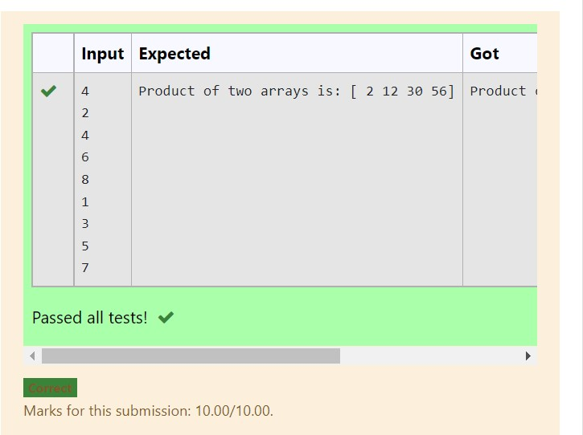

# Multiplying-two-matrix

## AIM:

## ALGORITHM:
### Step 1: Import numpy as np
### Step 2: Create a empty list
### Step 3: From for append the two lists
### Step 4: Assign the arrays
### Step 5: In result multiply the assigned variables
### STEP 6: Run the program


## PROGRAM:
```
import numpy as np
num1,num2=[],[]
n=int(input())
for i in range(n):
    num1.append(int(input()))
for i in range(n):
    num2.append(int(input()))
value1=np.array(num1)
value2=np.array(num2)
result=value1*value2
print("Product of two arrays is:",result)
``` 

## OUTPUT:


## RESULT:
Thus the program excuted

